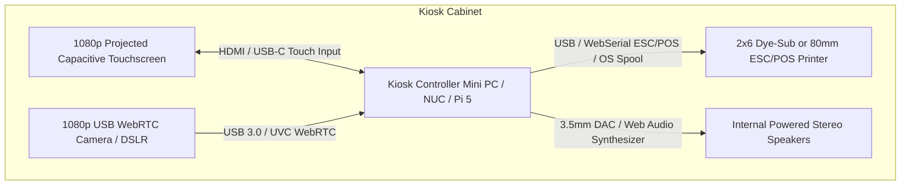

# Hardware Architecture & Peripheral Integration Guide

## 1. Physical Kiosk Wiring & Topology



---

## 2. Subsystem Implementation Status

To ensure complete engineering honesty, each subsystem driver is explicitly classified:

| Subsystem | Active Driver | Status | Description |
| :--- | :--- | :--- | :--- |
| **Touch Display** | Native CSS Touch & Kiosk UI | **LIVE** | 1080p/720p touch targets, overscroll suppression, text-selection disabled. |
| **Webcam** | `BrowserCameraService` | **LIVE** | WebRTC `navigator.mediaDevices.getUserMedia()` with canvas flash and filters. |
| **Demo Camera** | `VirtualDemoDriver` | **SIMULATED** | Headless multi-filter synthetic frame generator for automated test suites. |
| **DSLR Tethering** | `DSLRCameraDriver` | **STUB** | Architecture hook for tethered Canon/Sony cameras via WebUSB PTP/IP. |
| **Browser Print** | `BrowserPrintService` | **LIVE** | CSS `@media print` rules targeting OS desktop print spools or Chrome silent print. |
| **Thermal Printer**| `ThermalPrinterDriver` | **HARDWARE-READY** | Generates raw ESC/POS binary sequences (`ESC @`, font sizing, `GS V` auto-cut). |
| **Audio Synthesis**| `WebAudioService` | **LIVE** | Synthesized Web Audio oscillator chimes for countdowns, shutter, and matches. |

---

## 3. Printer Subsystem Drivers

### Option A: Standard Kiosk Silent Printing (Live)
Uses Chrome kiosk printing flags to dispatch photo strips directly to a default photo printer without user dialogs:
```bash
google-chrome --kiosk --kiosk-printing --incognito https://your-kiosk-app.local
```

### Option B: Native ESC/POS Thermal Printing (Hardware-Ready)
`src/services/hardware/thermalPrinter.ts` creates formatted ESC/POS byte buffers:
- Character Width/Height scaling: `GS ! 0x11`
- Center Justification: `ESC a 1`
- Bold Emphasis: `ESC E 1`
- Auto Paper Cut: `GS V 0x42 0x00` (Partial cut with paper feed)

---

## 4. Camera Viewfinder & Lifecycle Management

- **Resolution Profiles**: Configurable from 640×480 up to 1920×1080 with automatic aspect-ratio preservation.
- **Hardware Acceleration**: Captures frames into an offscreen HTML5 canvas element with zero main-thread jank.
- **Safe Teardown**: `cameraService.stopStream()` shuts down all `MediaStreamTrack` instances immediately upon session cleanup, freeing the camera device for subsequent users.

---

## 5. Touch & Operator Gesture Controls

- **Guest Touch Target Standard**: All primary interactive buttons are padded to a minimum of 48×48px (typically 64px tall) for responsive touch interaction.
- **Staff Operator Gesture**: Touch and hold the **top-right corner of the kiosk screen for 5 seconds**. This unlocks the PIN keypad overlay without exposing browser navigation bars or settings menus to guests.
