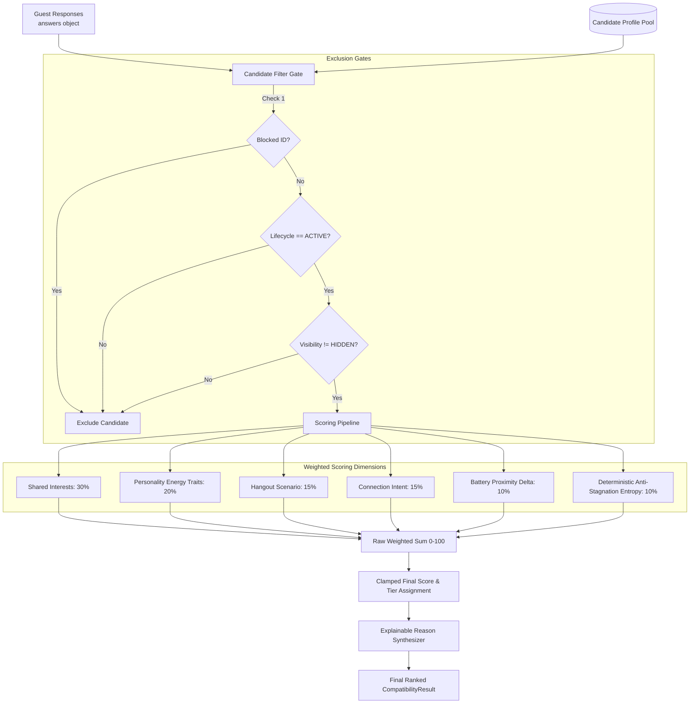

# Deterministic Matching Engine Specification (v2.4)

## 1. Ethical Guarantees & Non-Negotiable Boundaries

> **EXPLICIT BOUNDARIES:**
> - **No facial recognition.**
> - **No biometric profiling.**
> - **No attractiveness scoring.**
> - **No automated sentiment analysis of captured guest media.**

MagicMatch Booth connects people exclusively through self-declared interests, social battery dynamics, low-pressure hangout scenarios, and creative goals. Photographs captured in the booth are processed strictly for physical photo-strip printing and personal digital memories—never for algorithmic training or facial extraction.

---

## 2. Evaluation Pipeline Architecture

---

## 3. Weighted Compatibility Dimensions (Sum = 100%)

The algorithm computes a deterministic composite score $S \in [0, 100]$:

### 1. Shared Interests ($W = 30\%$)
Measures interest tag resonance between user selections and candidate tags:
$$\text{Score}_{\text{interests}} = \begin{cases} \left(\frac{|\text{Shared Interests}|}{|\text{User Interests}|}\right) \times 30 & \text{if } |\text{User Interests}| > 0 \\ 0 & \text{otherwise} \end{cases}$$

### 2. Personality / Energy Traits ($W = 20\%$)
Matches user's declared energy vibe (`chill`, `social`, `creative`, `introspective`) against candidate traits:
- `chill` $\rightarrow$ `['chill', 'grounded', 'deep']`
- `social` $\rightarrow$ `['social', 'playful', 'curious']`
- `creative` $\rightarrow$ `['creative', 'curious', 'playful']`
- `introspective` $\rightarrow$ `['deep', 'grounded', 'creative']`
$$\text{Score}_{\text{traits}} = \min\left(20, \frac{|\text{Compatible Traits}|}{|\text{Target Traits}|} \times 20\right)$$

### 3. Hangout Scenario Overlap ($W = 15\%$)
Low-pressure activity alignment (`cafe_vinyl`, `museum_walk`, `arcade_board`, `night_walk`, `food_crawl`, `indie_show`):
- Exact activity match: **15 pts**
- Exploratory / non-matched activity: **4 pts**

### 4. Connection Intent Alignment ($W = 15\%$)
Ensures mutual intentionality (`new_friends`, `creative_projects`, `hangouts`, `dating`, `study_partner`, `networking`):
$$\text{Score}_{\text{intent}} = \begin{cases} \left(\frac{|\text{Shared Intents}|}{|\text{User Intents}|}\right) \times 15 & \text{if } |\text{User Intents}| > 0 \\ 5 & \text{otherwise} \end{cases}$$

### 5. Social Battery Delta ($W = 10\%$)
Calculates proximity between user's current self-reported social battery (0–100%) and candidate's baseline social energy:
$$\Delta_{\text{battery}} = |\text{User Battery} - \text{Candidate Energy}|$$
$$\text{Score}_{\text{battery}} = \max\left(0, 10 - \frac{\Delta_{\text{battery}}}{10}\right)$$

### 6. Anti-Stagnation Entropy Injection ($W = 10\%$)
Prevents identical repeat sessions at a kiosk from locking into a monotonous top candidate. Generates a reproducible pseudo-random jitter derived deterministically from:
$$\text{Seed} = \text{SessionID} + \text{CandidateID} + \text{CandidateName}$$
$$\text{Score}_{\text{entropy}} = \text{hashToFloat}(\text{Seed}) \times 10$$
*No unseeded `Math.random()` is used during evaluation, guaranteeing 100% test reproducibility.*

---

## 4. Qualitative Compatibility Tiers

Scores are mapped into transparent, conversational tiers:

| Score Range | Classification Tier | Algorithmic Definition |
| :--- | :--- | :--- |
| **88 – 100%** | **Exceptional overlap** | Strong resonance across multiple primary passions, battery, and intent. |
| **75 – 87%** | **Very strong vibe** | High mutual interest alignment and compatible first hangout style. |
| **60 – 74%** | **Strong vibe** | Harmonious conversational wavelengths with complementary traits. |
| **40 – 59%** | **Potential connection** | Partial commonality with fresh, exploratory angles for discovery. |
| **0 – 39%** | **Unique vibe** | Independent profiles with minimal shared overlap. |

---

## 5. Explainability Synthesis

Rather than an opaque "black-box score", the engine generates 1–3 grounded natural language explanations derived directly from scoring components:
- *Shared resonance in photography and indie music.*
- *Both picked parallel low-pressure first hangouts (Cafe & Vinyl).*
- *Aligned social battery levels (65% vs 70%).*
- *Both seeking similar connection goals in the venue (creative projects).*
