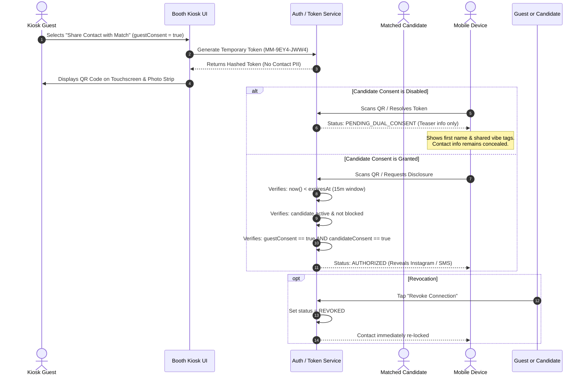

# Zero-Knowledge Privacy Architecture & Dual Consent

## 1. Core Privacy Philosophy

MagicMatch Booth is built on a **Zero-Knowledge Mutual Disclosure** principle:
1. **Never Publicize Contact Information**: Phone numbers, email addresses, and private Instagram handles are NEVER readable by anon users or public kiosk browsers.
2. **Dual Consent Authorization**: Contact channels are revealed if and only if **BOTH** the kiosk guest and candidate profile confirm explicit consent.
3. **Transient Lifespans**: Connection tokens strictly expire after **15 minutes**.
4. **Immediate Memory Purge**: Captured camera frames and object URLs are scrubbed upon session termination or timeout.

---

## 2. Dual-Consent Authorization Lifecycle



---

## 3. Contact Field Separation & Database Isolation

In the database schema (`supabase/schema.sql`), fields are strictly separated:

| Field Classification | Columns | Accessibility |
| :--- | :--- | :--- |
| **Publicly Matchable** | `display_name`, `age_range`, `city`, `avatar_seed`, `interests`, `traits`, `preferred_activities`, `social_energy` | Accessible to kiosk matching engine via `public_candidate_profiles` view. |
| **Private Protected** | `phone_encrypted`, `email_encrypted`, `instagram_handle` | Blocked by RLS. Disclosed **ONLY** through the `resolve_connection_contact` SECURITY DEFINER stored procedure. |

---

## 4. Temporary Connection Tokens

- **Format**: High-entropy 8-character string, formatted for readability: `MM-XXXX-XXXX` (e.g., `MM-9EY4-JWW4`).
- **Zero Raw PII**: The token string never contains phone numbers, usernames, or initials.
- **Server Storage**: Stored as a cryptographic hash (`token_hash`) in the database to prevent enumeration attacks.
- **Authoritative Expiration**: Token validity is enforced by server timestamps (`expires_at = created_at + 15 minutes`). Manipulating the client's device clock cannot extend token lifespan.

---

## 5. Session Cleanup & Kiosk Memory Purging

When a kiosk session finishes, times out, or is manually reset via the operator lock:
```typescript
async function resetBoothSession() {
  // 1. Revoke all temporary object URLs
  currentSession.photos.forEach((p) => PhotoProcessor.revoke(p.dataUrl));
  
  // 2. Clear volatile memory & LocalStorage current session buffer
  await repository.clearSession();
  
  // 3. Stop camera streams and flush WebGL textures
  cameraService.stopStream();
  
  // 4. Reset questionnaires and return immediately to Attract Mode
  setCurrentSession(freshSessionInAttractMode);
}
```
No guest's photos, answers, or match tokens remain on the display for the next person in line.

---

## 6. Safety, Reporting, and Blocking Controls

1. **1-Tap Blocking**: Guests can block any suggested candidate from the Kiosk Reveal screen. The candidate ID is immediately appended to `blocked_profiles` and will never appear in subsequent sessions.
2. **Mobile Incident Reporting**: The mobile portal allows visitors to flag inappropriate contact information, impersonation, or harassment. Reports are recorded in the `reports` audit log.
3. **Right to Revoke**: Mutual consent can be withdrawn at any time by either participant, instantly changing token status to `REVOKED`.
