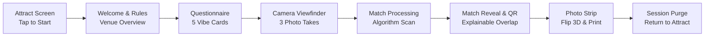
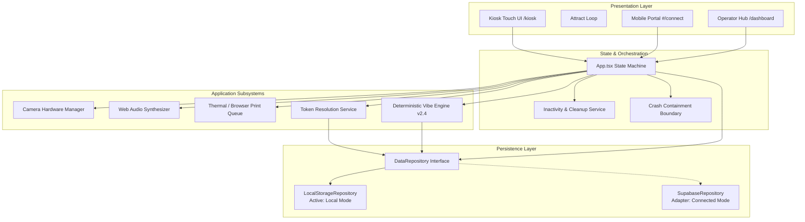
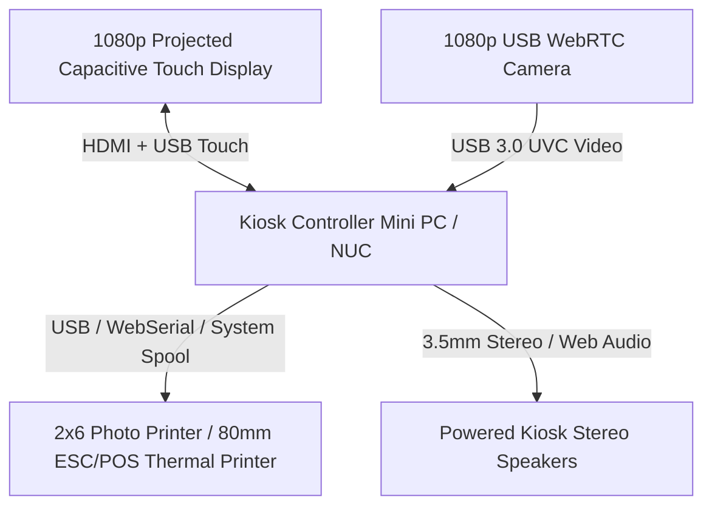

# MagicMatch Booth

## Take a picture. Meet your vibe.

MagicMatch Booth is an interactive, physical photo-booth kiosk software designed for coffee shops, art lounges, community centers, and cultural venues. Guests step up to the touchscreen, answer five quick questions about their passions and social battery, take three studio-lit photos, receive a customized 2"×6" photo strip, and discover a high-compatibility connection from the local venue community—all while strictly safeguarding personal privacy.

---

## Honest Subsystem Status

To maintain transparent engineering discipline, this software explicitly categorizes each component's active operational state:

| Subsystem | Active Mode | Operational Classification | Description |
| :--- | :--- | :--- | :--- |
| **Kiosk Touch Experience** | Touchscreen UI | **LIVE** | Fullscreen 1080p kiosk layout, attract mode, 120s inactivity timer, touch targets. |
| **Deterministic Vibe Engine** | Algorithm v2.4 | **LIVE** | 6-dimension weighted compatibility scoring (0–100%) with explainability. |
| **Privacy Contact Gating** | Zero-Knowledge | **LIVE** | Dual consent state machine; phone numbers/emails never revealed without mutual approval. |
| **Webcam Capture** | WebRTC | **LIVE** | Real-time browser camera stream with canvas flash, countdowns, and 4 photo filters. |
| **Virtual Demo Camera** | Synthetic Frames | **SIMULATED** | Headless frame generator for automated CI/CD and kiosk hardware testing. |
| **DSLR Tethering Driver** | WebUSB PTP/IP | **STUB** | Driver architectural contract ready for tethered Canon/Sony cameras. |
| **Photo Strip Print Spool** | Browser Spool | **LIVE** | Printable 3D strip layout utilizing CSS `@media print` and silent Chrome printing. |
| **Thermal Printer Driver** | ESC/POS Generator | **HARDWARE-READY** | Generates raw ESC/POS binary buffers (`ESC @`, font sizing, bold, `GS V` auto-cut). |
| **Data Persistence (Default)**| Local Storage | **LOCAL (OFFLINE)** | Local-First storage; runs 100% autonomously in venues without internet connectivity. |
| **Data Persistence (Cloud)** | Supabase / Postgres | **BACKEND-READY** | Production SQL schema (`supabase/schema.sql`) and PostgREST repository adapter ready. |
| **Mobile QR Connection** | Token Gateway | **LOCAL / DEMO** | Generates 15-minute temporary tokens (`MM-XXXX-XXXX`). Works locally or over public URL if hosted. |

---

## Project Overview

Traditional photo booths take photos and give guests a keepsake, but the social experience ends the moment they step outside. Dating and networking apps connect people online, but are frequently burdened by swiping fatigue, superficial attractiveness filtering, and invasive location tracking.

MagicMatch Booth combines the tactile delight of a classic photo booth with a **privacy-first, deterministic discovery engine**:
- **No Attractiveness Scoring**: Appearance, facial geometry, gender presentation, or physical traits are never factored into match recommendations.
- **Explainable Synergy**: Guests understand exactly why they matched (e.g., *"Shared resonance in architecture and Japanese ambient vinyl"*).
- **Physical Keepsake**: A printed 2"×6" photo strip displaying the user's photos on Side A, and candidate vibe insights on Side B.
- **Ephemeral Mobile Discovery**: A 15-minute temporary token accessible via QR code allows guests to connect on their phones without revealing their phone number or handle until mutual consent is granted.

---

## Key Features

- **Dedicated Kiosk Mode (`/kiosk`)**: Fullscreen, zero-distraction touchscreen layout designed for 1920×1080, 1366×768, and 1024×768 physical kiosk displays.
- **Cinematic Attract Mode**: Ambient video lens animation, subtle orbital particles, floating photo strips, and periodic *"Match Found"* pulses to invite passing venue guests.
- **Session Lifecycle & Inactivity Guard**: Automated 120-second timeout warning with 20-second visual countdown; completely purges memory upon guest abandonment.
- **Deterministic Vibe Engine v2.4**: 100% reproducible, multi-dimensional scoring across interests (30%), personality energy (20%), hangout scenarios (15%), connection intent (15%), battery delta (10%), and anti-stagnation entropy (10%).
- **Dual-Consent Authorization**: Private contacts are concealed behind a server-authoritative gatekeeper. Both parties must confirm consent before phone or Instagram handles are disclosed.
- **3D Photo Strip Preview**: Interactive CSS 3D transform that flips between Side A (studio photos) and Side B (vibe breakdown and QR token).
- **Subsystem Telemetry & Operator Hub (`/dashboard`)**: Hidden 5-second corner hold gesture unlocks staff controls, thermal print spooler monitoring, ESC/POS cut tests, and event logs.
- **Mobile Companion Portal (`#/connect/:token`)**: Mobile-optimized verification page for visitors scanning the strip's QR code.

---

## User Flow



1. **Step 0 — Attract Screen**: Kiosk waits in animated idle loop. Touching anywhere begins the session.
2. **Step 1 — Welcome**: Brief onboarding explaining that photos belong solely to the guest.
3. **Step 2 — How It Works**: Explains the 5 vibe questions, camera countdown, and mutual consent rules.
4. **Step 3 — Questionnaire**: 5 touch-friendly questions: Energy vibe, 3 interest tags, preferred hangout venue, social battery slider, and connection intent.
5. **Step 4 — Camera Capture**: Viewfinder with 3-second audio countdown beeps, canvas flash, review takes, and filter toggles.
6. **Step 5 — Matching**: Algorithmic scan across active venue candidate profiles.
7. **Step 6 — Match Reveal**: High-compatibility candidate unveiled with score, explainable reasons, and high-entropy connection token.
8. **Step 7 — Photo Strip & Print**: View 2"×6" digital photo strip, flip to inspect reverse candidate insights, and dispatch to print queue.
9. **Step 8 — Session Cleanup**: All temporary data, canvas frames, and object URLs are purged from browser memory.

---

## System Architecture



---

## Matching Engine

The deterministic matching engine (`src/services/matching/engine.ts`) version **v2.4** evaluates user responses against candidate profiles using six normalized dimensions:

1. **Shared Interests (30%)**: Jaccard similarity across selected interest tags.
2. **Personality & Energy Traits (20%)**: Congruence between declared energy vibe and target trait tags.
3. **Hangout Scenario (15%)**: Alignment on low-pressure venues (e.g., *Cafe & Vinyl*, *Night Walk*, *Arcade*).
4. **Connection Intent (15%)**: Shared intentionality (*Creative Projects*, *New Friends*, *Study Partner*, *Dating*).
5. **Social Battery Proximity (10%)**: Delta between user's current slider (0–100%) and candidate's baseline battery.
6. **Anti-Stagnation Entropy (10%)**: Reproducible deterministic hash derived from session ID and candidate attributes to ensure tie-breakers remain varied across repeat sessions.

> **Absolute Privacy Guarantee**: The matching engine operates entirely on categorical tags and numerical delta calculations. It contains zero facial recognition, zero image processing, and zero biometric profiling.

---

## Privacy Model

- **Dual Consent State Machine**: Both the kiosk guest and the candidate must confirm consent before contact information is revealed.
- **Private Field Isolation**: In the database schema, sensitive columns (`phone_encrypted`, `email_encrypted`, `instagram_handle`) are isolated and never returned by public queries.
- **Server-Authoritative Lifespan**: Connection tokens automatically expire after **15 minutes** based on server timestamps.
- **Immediate Memory Purging**: `resetBoothSession()` revokes all blob URLs and frees memory when a guest completes their session or walks away.
- **1-Tap Revocation & Blocking**: Either participant can withdraw consent or block a profile immediately.

---

## Hardware Architecture



- **Thermal Printer ESC/POS Generator** (`src/services/hardware/thermalPrinter.ts`): Formats binary receipt commands (`ESC @`, centering, double-width text, and `GS V` automatic paper cutting).
- **Camera Device Manager** (`src/services/hardware/cameraManager.ts`): Video device enumeration, aspect-ratio preservation, and stream latency telemetry.

---

## Database Architecture

A production-ready PostgreSQL / Supabase migration schema is provided in `supabase/schema.sql`:

- `venues`: Venue locations, brand accent colors, and contact info.
- `booths`: Individual kiosk hardware profiles, status, and heartbeat timestamps.
- `profiles`: Candidate discovery pool separating public attributes from encrypted private contacts.
- `profile_interests`, `profile_traits`, `profile_preferred_activities`, `profile_connection_intents`: Normalized tag relationships.
- `candidate_preferences`: Desired match criteria, radius, and age brackets.
- `sessions`, `answers`: Session questionnaire entries.
- `captured_media_metadata`: Photo references (metadata only; raw images are not stored in the database).
- `matches`: Scored pairings, compatibility tier, and component breakdown.
- `connection_consents`, `connection_tokens`: Hashed temporary tokens and dual-consent timestamps.
- `blocked_profiles`, `reports`: Guest moderation tools.
- `print_jobs`, `booth_events`, `operator_actions`: Audit logs for venue diagnostics.

---

## Local Development

### Prerequisites
- Node.js 18+ or 20+
- npm or pnpm

### Quick Start
```bash
# 1. Clone the repository
git clone https://github.com/your-username/magicmatch-booth.git
cd magicmatch-booth

# 2. Install dependencies
npm install

# 3. Start development server (Port 3000)
npm run dev

# 4. Open in browser
# Kiosk Mode: http://localhost:3000/#/kiosk
# Operator Hub: http://localhost:3000/#/dashboard
# Mobile Connect: http://localhost:3000/#/connect
```

---

## Environment Variables

Copy `.env.example` to `.env` if configuring optional remote services:

```env
# Optional Supabase Integration (Leave unset to run in offline LOCAL MODE)
# VITE_SUPABASE_URL="https://your-project.supabase.co"
# VITE_SUPABASE_ANON_KEY="your-public-publishable-key"

# Hardware peripherals
VITE_PRINTER_INTERFACE="browser"
VITE_CAMERA_SOURCE="browser"

# Base URL for QR codes
APP_URL="https://your-booth-domain.com"
```

> **Security Note**: Never expose Supabase `service_role` keys or database passwords in frontend configuration.

---

## Testing

The project includes an automated test suite covering algorithm edge cases, lifecycle filtering, dual consent, and hardware buffer generation:

```bash
# Run unit tests
npm test

# Run TypeScript type check
npm run typecheck

# Run production build verification
npm run build
```

### Verified Test Cases
- **Case A**: Strong multi-dimensional overlap (score $\ge 80\%$).
- **Case B**: Weak overlap (score $< 40\%$, Unique vibe tier).
- **Case C**: Matching interests with conflicting intent (intent penalty verification).
- **Case D**: Aligned intent with zero shared interests.
- **Case E**: Blocked candidate exclusion.
- **Case F**: Dual-consent truth matrix (all 4 boolean permutations).
- **Case G**: Deterministic session seed reproducibility.
- **Case H**: High-entropy token generation (`MM-XXXX-XXXX`, zero raw PII).
- **Case I**: Profile lifecycle gating (DRAFT, PAUSED, HIDDEN, BLOCKED filtering).
- **Case J**: Server-authoritative expiration after 15 minutes.
- **Case K**: Dual-consent state machine (Pending $\rightarrow$ Mutual Authorized $\rightarrow$ Revocation).
- **Case L**: ESC/POS thermal command buffer generation with paper-cut trigger.

---

## Physical Kiosk Deployment

For standalone physical installations, launch Chrome in fullscreen kiosk mode:

```bash
google-chrome \
  --kiosk \
  --incognito \
  --kiosk-printing \
  --disable-pinch \
  --overscroll-history-navigation=0 \
  https://your-kiosk-app.local
```

### Operator Access
- **Gesture**: Touch and hold the **top-right corner of the kiosk screen for 5 seconds**.
- **PIN (DEVELOPMENT / DEMO ONLY)**: `1234`.
  - *Production Notice*: Commercial venue kiosks must replace the local demo PIN with server-backed authentication or physical NFC staff badges.

---

## Limitations

- **Physical Printer**: While the ESC/POS driver generates valid binary command buffers, real-world deployment requires a compatible USB thermal receipt printer or dye-sub printer configured in the OS.
- **Local Network QR**: In pure offline local-first mode, guests scanning QR codes must be connected to the venue's local Wi-Fi or have the booth connected to an internet domain.
- **Biometrics**: MagicMatch deliberately omits facial recognition and automated emotion scoring by design.

---

## Roadmap

- [ ] WebUSB direct thermal printer integration without OS driver dialogs.
- [ ] Venue multi-booth synchronization over local mDNS/WebSockets.
- [ ] NFC / RFID physical badge reader support for operator login.
- [ ] Multi-language localization (Spanish, Japanese, French).
- [ ] Optional venue host console for lounge event moderation.

---

## License

This software and its documentation are currently **UNLICENSED**. All rights are reserved by the original authors. See `LICENSE` for details.
